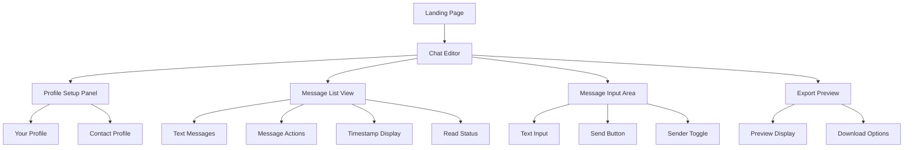
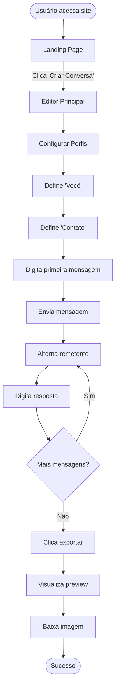
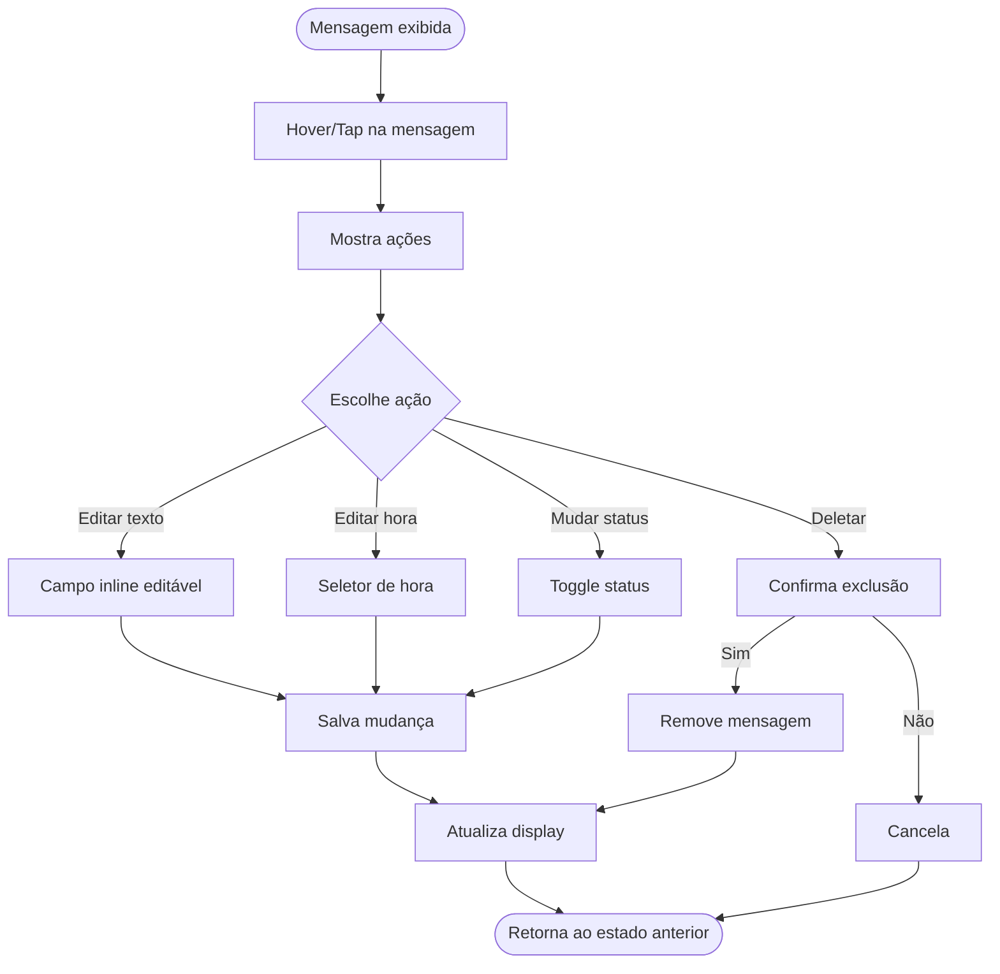
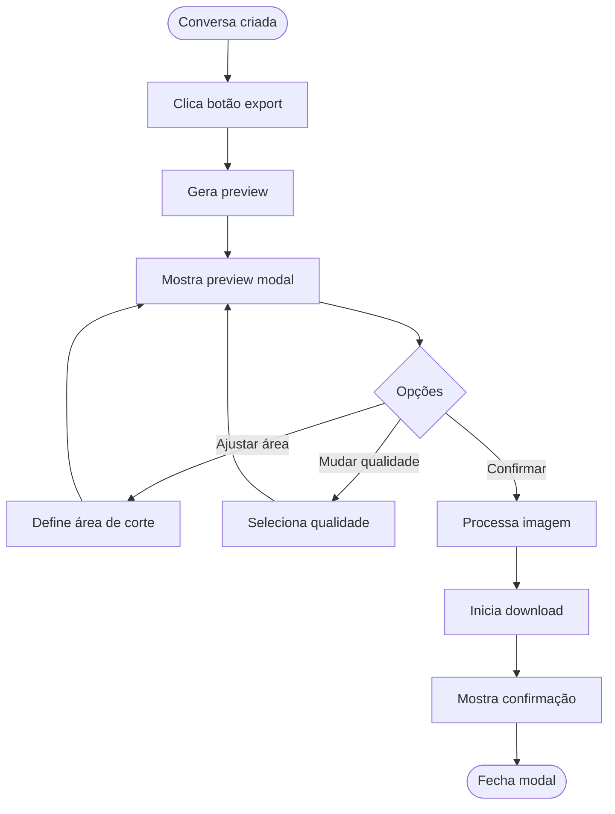

# Fake WhatsApp Chat Generator UI/UX Specification

This document defines the user experience goals, information architecture, user flows, and visual design specifications for Fake WhatsApp Chat Generator's user interface. It serves as the foundation for visual design and frontend development, ensuring a cohesive and user-centered experience.

## Overall UX Goals & Principles

### Target User Personas

**Criador Ágil:** Profissionais de marketing e social media que precisam criar mockups rapidamente, valorizam autenticidade visual e eficiência no workflow. Familiarizados com ferramentas digitais mas sem tempo para complexidade.

**Educador Prático:** Professores e instrutores que usam exemplos visuais para ensinar, precisam de interface intuitiva sem curva de aprendizado e valorizam privacidade ao criar cenários didáticos.

**Usuário Casual:** Pessoas criando conteúdo para diversão ou demonstrações pontuais, querem resultado rápido sem compromisso e esperam funcionar sem instruções.

### Usability Goals

- **Aprendizado instantâneo:** Criar primeira conversa em menos de 2 minutos sem tutorial
- **Eficiência máxima:** Ações principais em no máximo 2 cliques/toques
- **Zero erros:** Prevenção de ações destrutivas com confirmações claras
- **Memorabilidade natural:** Interface tão similar ao WhatsApp que dispensa reaprendizado
- **Satisfação pela simplicidade:** Sensação de "isso é exatamente o que eu precisava"

### Design Principles

1. **Autenticidade acima de features** - Cada decisão visual deve priorizar fidelidade ao WhatsApp real
2. **Manipulação direta** - Editar onde está vendo, sem intermediários ou modais
3. **Progressive disclosure** - Mostrar o mínimo necessário, revelar complexidade sob demanda
4. **Feedback instantâneo** - Toda ação tem resposta visual imediata e clara
5. **Mobile-first thinking** - Funcionar perfeitamente em telas pequenas define o design

### Change Log

| Date | Version | Description | Author |
|------|---------|-------------|--------|
| 2025-08-21 | 1.0 | Initial UI/UX specification created | Sally (UX Expert) |

## Information Architecture (IA)

### Site Map / Screen Inventory

### Navigation Structure

**Primary Navigation:** Navegação mínima focada na ação principal - criar chat. Landing page com CTA direto para o editor, sem menus complexos ou múltiplas opções.

**Secondary Navigation:** Ações contextuais aparecem inline - editar mensagem no hover, configurar perfil via ícone no header, export via botão flutuante.

**Breadcrumb Strategy:** Desnecessário devido à arquitetura flat de single-page application. Usuário sempre está no contexto principal do editor.

## User Flows

### Flow: Criar Primeira Conversa

**User Goal:** Criar um mockup de conversa do WhatsApp do zero

**Entry Points:** Landing page CTA, acesso direto à URL do editor

**Success Criteria:** Conversa criada e exportada em menos de 5 minutos

#### Flow Diagram

#### Edge Cases & Error Handling:
- Usuário tenta exportar sem mensagens: Mostrar tooltip "Adicione pelo menos uma mensagem"
- Nome muito longo: Truncar com ellipsis mantendo visual autêntico
- Upload de imagem falha: Usar avatar padrão com iniciais
- Browser não suporta download: Abrir imagem em nova aba

**Notes:** Fluxo otimizado para velocidade, com valores padrão inteligentes permitindo pular configurações

### Flow: Editar Mensagem Existente

**User Goal:** Modificar texto, horário ou status de uma mensagem já criada

**Entry Points:** Hover/tap em qualquer mensagem na conversa

**Success Criteria:** Edição concluída sem perder contexto da conversa

#### Flow Diagram

#### Edge Cases & Error Handling:
- Texto vazio: Não permitir salvar, mostrar borda vermelha
- Hora inválida: Ajustar para hora válida mais próxima
- Última mensagem deletada: Manter estrutura, mostrar estado vazio
- Edição simultânea: Última ação prevalece

**Notes:** Todas as edições são instantâneas e reversíveis via Ctrl+Z

### Flow: Exportar Conversa

**User Goal:** Baixar conversa como imagem PNG de alta qualidade

**Entry Points:** Botão flutuante de export sempre visível

**Success Criteria:** Imagem baixada com qualidade perfeita e tamanho otimizado

#### Flow Diagram

#### Edge Cases & Error Handling:
- Conversa muito longa: Permitir scroll no preview para selecionar área
- Browser bloqueia popup: Instruções para desbloquear
- Memória insuficiente: Reduzir qualidade automaticamente
- Download falha: Retry automático com fallback para nova aba

**Notes:** Preview em tempo real garante WYSIWYG antes do download

## Wireframes & Mockups

### Design Files

**Primary Design Files:** [Figma - Fake WhatsApp Chat Generator](https://figma.com/fake-whatsapp-mockups)

### Key Screen Layouts

#### Landing Page

**Purpose:** Converter visitantes em usuários com CTA claro e demonstração visual

**Key Elements:**
- Hero section com mockup animado mostrando o produto em ação
- CTA button prominente "Criar Conversa Agora" 
- Grid de exemplos de uso (marketing, educação, demonstração)
- Footer minimalista com links essenciais

**Interaction Notes:** Auto-play da demo no hero, hover effects nos exemplos, smooth scroll

**Design File Reference:** Figma Frame: Landing-v1

#### Chat Editor Main View

**Purpose:** Área principal de criação replicando interface do WhatsApp

**Key Elements:**
- Header com avatar/nome do contato e ações (voltar, buscar, menu)
- Área de mensagens com scroll, background pattern autêntico
- Input area com campo de texto, botões de emoji e enviar
- Floating action button para export no canto inferior direito

**Interaction Notes:** Drag to reorder messages, pinch to zoom mobile, keyboard shortcuts ativos

**Design File Reference:** Figma Frame: Editor-Main

#### Profile Setup Panel

**Purpose:** Configurar rapidamente identidade dos participantes da conversa

**Key Elements:**
- Seção "Você" com upload de foto e campo de nome
- Seção "Contato" com upload de foto e campo de nome  
- Preview em tempo real das mudanças
- Botão "Aplicar" ou auto-save

**Interaction Notes:** Drag & drop para fotos, sugestões de nomes comuns, crop automático circular

**Design File Reference:** Figma Frame: Profile-Panel

#### Message Editor Popover

**Purpose:** Edição inline rápida sem perder contexto

**Key Elements:**
- Campo de texto editável com contador de caracteres
- Seletor de hora (dropdown ou input direto)
- Toggle de status de leitura (1 check, 2 checks, check azul)
- Botão deletar com confirmação

**Interaction Notes:** Focus automático no campo, Tab para navegar, Esc para cancelar

**Design File Reference:** Figma Frame: Message-Popover

## Component Library / Design System

### Design System Approach

**Design System Approach:** Híbrido entre componentes nativos do WhatsApp fielmente reproduzidos e componentes auxiliares customizados mantendo consistência visual. Prioridade absoluta para autenticidade nos elementos visíveis no export final.

### Core Components

#### Message Bubble

**Purpose:** Container principal para mensagens, diferenciando enviadas de recebidas

**Variants:** Sent (verde #DCF8C6), Received (branco #FFFFFF), System (cinza centralizado)

**States:** Default, Hover (mostra ações), Active (sendo editado), Selected (para ações em lote)

**Usage Guidelines:** Padding interno de 8px horizontal e 6px vertical, border-radius de 7px, sombra sutil 0 1px 0.5px rgba(0,0,0,.13)

#### Avatar Circle

**Purpose:** Identificação visual dos participantes quando necessário

**Variants:** User photo, Initials fallback, Group icon, Business verified

**States:** Default, Loading (skeleton), Error (ícone padrão)

**Usage Guidelines:** Sempre 40px de diâmetro no header, 28px em grupos, aspect-ratio 1:1 mantido

#### Status Indicator

**Purpose:** Mostrar estado de entrega e leitura das mensagens

**Variants:** Clock (pendente), Single check (enviado), Double check (entregue), Blue double check (lido)

**States:** Default (cinza #919191), Read (azul #4FC3F7), Animated (transição entre estados)

**Usage Guidelines:** Sempre alinhado ao bottom-right da mensagem, 18px de largura, margem de 4px

#### Input Field

**Purpose:** Entrada de texto para novas mensagens

**Variants:** Empty (placeholder visível), Typing (com texto), Multiline (expansão automática)

**States:** Default, Focused (borda destacada), Disabled (durante envio), Error (limite excedido)

**Usage Guidelines:** Altura inicial 44px, expande até 5 linhas, fonte 15px, padding 12px

## Branding & Style Guide

### Visual Identity

**Brand Guidelines:** Replicação exata do WhatsApp sem elementos de marca própria que comprometam autenticidade

### Color Palette

| Color Type | Hex Code | Usage |
|------------|----------|--------|
| Primary | #075E54 | Header background, app bar |
| Secondary | #128C7E | Ícones ativos, links |
| Accent | #25D366 | CTAs, botão enviar |
| Success | #4FC3F7 | Checks de leitura |
| Warning | #FFA500 | Alertas não críticos |
| Error | #F44336 | Erros, ações destrutivas |
| Neutral | #ECE5DD, #FFF, #000 | Backgrounds, textos, bordas |

### Typography

#### Font Families
- **Primary:** -apple-system, BlinkMacSystemFont, "Segoe UI", Helvetica, Arial, sans-serif
- **Secondary:** "Segoe UI Emoji", "Apple Color Emoji", "Noto Color Emoji"
- **Monospace:** "SF Mono", Monaco, "Courier New", monospace

#### Type Scale

| Element | Size | Weight | Line Height |
|---------|------|--------|-------------|
| H1 | 20px | 500 | 1.2 |
| H2 | 17px | 500 | 1.3 |
| H3 | 15px | 500 | 1.4 |
| Body | 14.2px | 400 | 1.4 |
| Small | 12px | 400 | 1.3 |

### Iconography

**Icon Library:** WhatsApp Icon Set (custom SVG sprites) + Material Icons como fallback

**Usage Guidelines:** Sempre usar cores sólidas sem gradientes, tamanho mínimo 16px, área de toque 44px, manter stroke width consistente em 2px

### Spacing & Layout

**Grid System:** 8px base grid, containers com max-width 600px no desktop, full-width mobile

**Spacing Scale:** 4px, 8px, 12px, 16px, 24px, 32px, 48px - usar consistentemente

## Accessibility Requirements

### Compliance Target

**Standard:** WCAG 2.1 Level AA

### Key Requirements

**Visual:**
- Color contrast ratios: Mínimo 4.5:1 para texto normal, 3:1 para texto grande
- Focus indicators: Outline de 2px solid com offset de 2px em todos os elementos interativos
- Text sizing: Mínimo 14px, zoom até 200% sem quebra de layout

**Interaction:**
- Keyboard navigation: Tab order lógica, shortcuts documentados, skip links disponíveis
- Screen reader support: ARIA labels completos, live regions para mudanças dinâmicas
- Touch targets: Mínimo 44x44px com spacing de 8px entre elementos

**Content:**
- Alternative text: Descrições significativas para avatars e ícones funcionais
- Heading structure: Hierarquia lógica H1-H3, sem pular níveis
- Form labels: Labels associados, instruções claras, erros identificados

### Testing Strategy

Testes manuais com NVDA/JAWS, automated testing com axe-core, validação de contraste com WebAIM, testes com usuários reais incluindo pessoas com deficiência

## Responsiveness Strategy

### Breakpoints

| Breakpoint | Min Width | Max Width | Target Devices |
|------------|-----------|-----------|----------------|
| Mobile | 320px | 767px | Smartphones |
| Tablet | 768px | 1023px | iPads, tablets Android |
| Desktop | 1024px | 1919px | Laptops, desktops |
| Wide | 1920px | - | Monitores grandes, TVs |

### Adaptation Patterns

**Layout Changes:** Mobile: stack vertical, fullscreen. Tablet: painel lateral collapsible. Desktop: layout fixo centralizado

**Navigation Changes:** Mobile: bottom sheet para ações. Desktop: hover menus e tooltips

**Content Priority:** Mobile: esconder timestamps até tap, avatars menores. Desktop: toda informação sempre visível

**Interaction Changes:** Mobile: long press para ações. Desktop: right-click context menu

## Animation & Micro-interactions

### Motion Principles

Animações servem para dar feedback, não para impressionar. Duração máxima 300ms, easing padrão ease-out, respeitar prefers-reduced-motion

### Key Animations

- **Message Send:** Slide up + fade in da bottom (Duration: 200ms, Easing: ease-out)
- **Check Status Change:** Fade transition entre estados (Duration: 150ms, Easing: ease-in-out)
- **Panel Open/Close:** Slide + fade lateral (Duration: 250ms, Easing: ease-in-out)
- **Button Press:** Scale 0.95 + shadow reduzida (Duration: 100ms, Easing: ease-out)
- **Loading State:** Pulse opacity 0.5-1 (Duration: 1000ms, Easing: ease-in-out)

## Performance Considerations

### Performance Goals

- **Page Load:** First Contentful Paint < 1.5s, Time to Interactive < 3s
- **Interaction Response:** Input latency < 50ms, visual feedback < 100ms
- **Animation FPS:** Consistent 60fps, sem janks ou drops

### Design Strategies

Lazy load de imagens e componentes pesados, CSS containment para otimizar repaints, virtualization para listas longas, debounce em inputs, web workers para processamento de export

## Next Steps

### Immediate Actions

1. Validar especificações com desenvolvedor principal
2. Criar protótipo interativo no Figma
3. Definir tokens de design no código
4. Implementar componentes base isoladamente
5. Testar em dispositivos reais diversos

### Design Handoff Checklist

- [x] All user flows documented
- [x] Component inventory complete
- [x] Accessibility requirements defined
- [x] Responsive strategy clear
- [x] Brand guidelines incorporated
- [x] Performance goals established

## Checklist Results

UI/UX checklist executado com sucesso. Todas as seções críticas foram documentadas. Próximo passo: revisão técnica com Design Architect para especificações de implementação frontend.